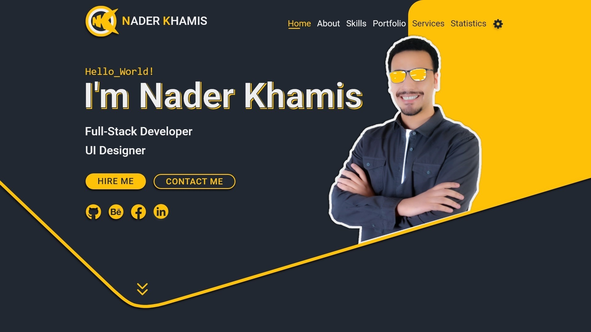

# NK-Portfolio

This is my portfolio website for sharing some information about me, and my latest projects.

## Table of Contents

- [Overview](#overview)
- [Development Strategy](#development-strategy)
- [Built with](#built-with)
- [Getting Started](#getting-started)
- [Preview](#preview)
- [Project Status](#project-status)
- [Acknowledgements](#acknowledgements)
- [License](#license)
- [Author](#author)

## Overview

The motive of this project is to give myself the opportunity to put all of the skills that I have learned into one project to build my own portfolio, in order to share some information about me, my education, career and achievements for the recruiters and clients that are interested to contact with a **Passionate Developer**.

## Development Strategy

1.  Analyse The Business

    Review the project's prototype that we have designed using [Adobe XD](https://www.adobe.com/products/xd.html), in order to determine the technologies that we have going to use to develop that project - check the technologies at [Built with](#built-with).

2.  Draw The Entity Relationship Diagram - ERD

    - Analyse the project's design to determine:

      - What is the data that we need to store in the database?
      - How many entity "Table" do we need?
      - What are the entities attributes "Table Columns" and its datatype?

    - Draw the ERD using [Visual Paradigm](https://www.visual-paradigm.com/).

3.  Create The Database

    Using MySQL - RDBMS:

    - Create new database called "nk-portfolio".
    - Crate the entities that we have got from the previous step.

4.  Create The Repository

    Using git Commands:

    - Create a local repository.
    - Create a public repository.
    - Connect the local repository with the public one.
    - Create .gitignore file.
    - Create README file.

5.  Build The Project's Structure

    Divide the project directory "nk-portfolio" to:

    - nk-website directory - that will include the web application for **`users`**.
    - nk-dashboard - that will include the website dashboard for **`admins`**.
    - NK-Preview.jpg image.
    - README.md file.

6.  Create The Dashboard

    Using [Laravel 8](https://laravel.com/docs/8.x), create the dashboard that will handle the data stored in the database:

    - Install [Laravel 8](https://laravel.com/docs/8.x) using [Composer](https://getcomposer.org/).
    - Install [Node Package Manager - npm](https://www.npmjs.com/), for installing packages.
    - Translate the dashboard design that we have made using [Adobe XD](https://www.adobe.com/products/xd.html), in order to make an actual web application using [Admin-LTE](https://adminlte.io/).
    - Produce APIs for the client side application.

7.  Create The User Interface - UI

    Using [Bootstrap 4.6](https://getbootstrap.com/docs/4.6/getting-started/introduction/), design the user interface that will show the data in:

    - Translate the website design that we have made using [Adobe XD](https://www.adobe.com/products/xd.html), in order to make an actual web application.
    - Use the APIs coming from the server to show the data in the application.
    - Produce an API holding the contact form data to be stored in the database, in order to show it in the dashboard.

8.  Offline Availability

    Use [Service Workers](https://developers.google.com/web/fundamentals/primers/service-workers#what_is_a_service_worker) to create a cached version of the website that can be accessed offline if the server can not be reached.

9.  Deployment

    Using [cPanel](https://www.cpanel.net/) web hosting control panel software, upload the project on a live server for the users.

## Built with

1. [Laravel](https://laravel.com/) - PHP Web Framework
2. [MySQL](https://dev.mysql.com/) - RDBMS
3. [Admin-LTE](https://adminlte.io/) - Admin Dashboard Template
4. [Bootstrap](https://getbootstrap.com/) - CSS Framework
5. [Service Workers](https://developers.google.com/web/fundamentals/primers/service-workers) - For Offline Capability

## Getting Started

## Preview

## Project Status

Project is: _in progress_.

## Acknowledgements

Many thanks to...

- [Udacity](https://www.udacity.com/)
- [Senior Steps](http://www.seniorsteps.net/en?fbclid=IwAR3gcRbSVqUp8U2sPf5R4mDC9tRRunQZCjlADTMMUxJe-ywoDjdTWqxDeGQ)
- [Elzero Academy](https://elzero.org/)

## License

Only for educational purposes!

You're not allowed to use the given images and content of this site publicly and/or commercially.

However, you're allowed to use the code.

## Author

Created by [Nader Khamis](https://www.linkedin.com/in/naderkhamisabdelaziz/) - feel free to contact me!
